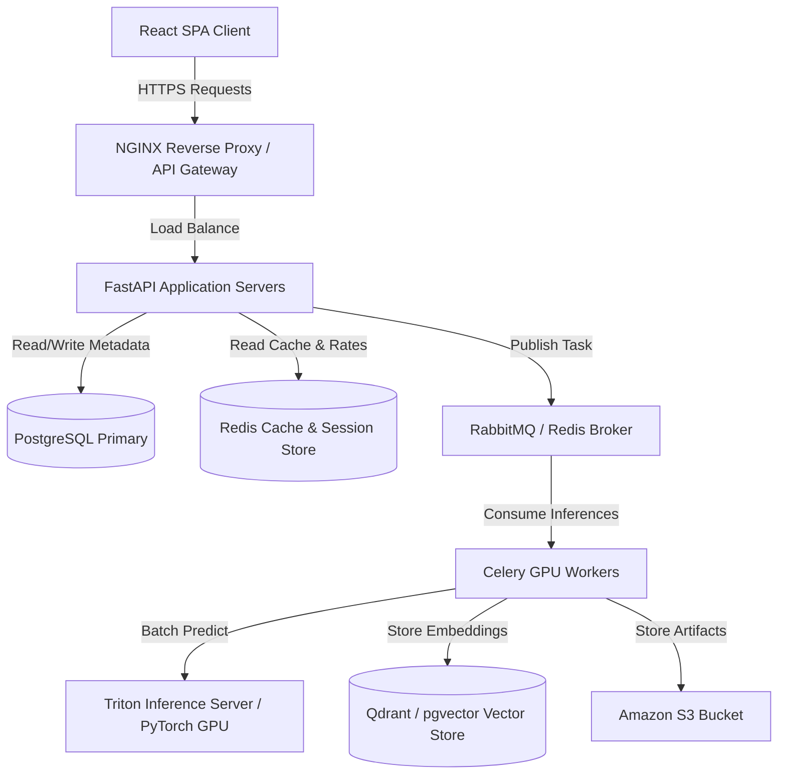
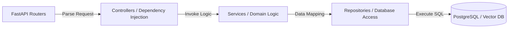
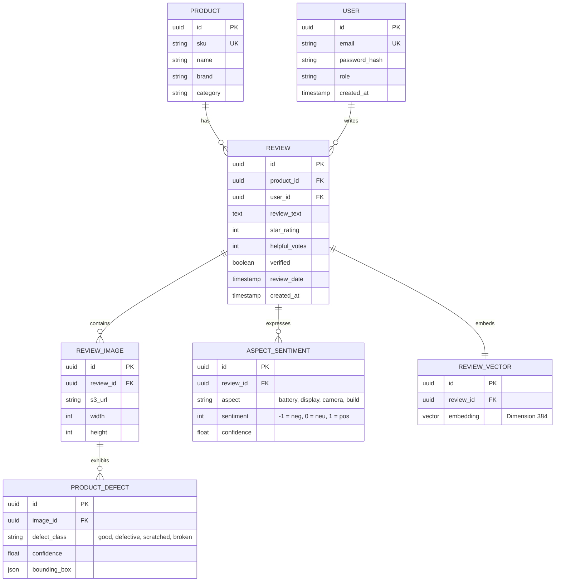
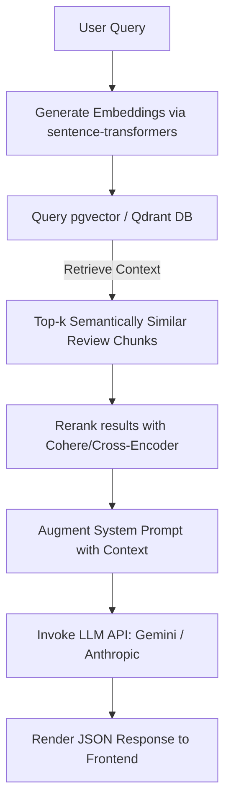
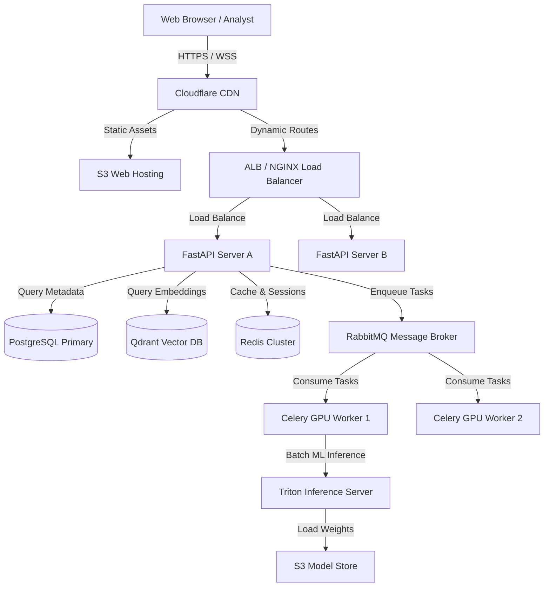
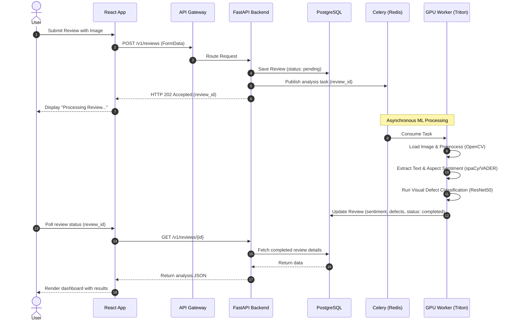
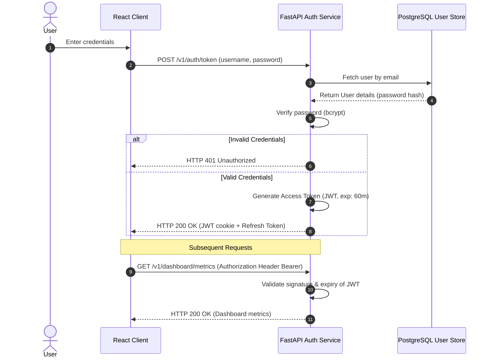
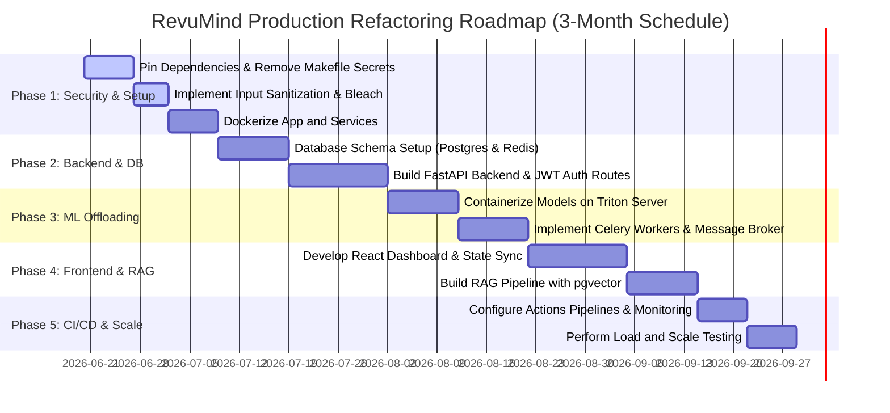

# Software Architecture & Production Readiness Report
**Project:** RevuMind (Multimodal Product Review Intelligence System)  
**Author:** Senior Software Architect & Staff Software Engineer  
**Date:** June 19, 2026  

---

## Executive Summary
RevuMind is currently structured as an **exploratory data science and machine learning workspace** using the Cookiecutter Data Science template. It successfully implements complex ML pipelines—including PyTorch multimodal late/attention fusion models, ResNet50-based image defect classifiers, text sentiment analysis ensembling VADER & Scikit-Learn classifiers, and Named Entity Recognition (NER) with spaCy. 

However, from an enterprise software engineering perspective, the system is an **exploratory prototype**. It lacks a decoupled client-server architecture, database integration, API endpoints, authentication, job queues, scalability abstractions, and security.

This report analyzes the current codebase, exposes architectural issues, and presents a production-grade blueprint designed to scale the platform to **100,000+ active users**.

---

## 1. High-Level Architecture
### Current Architectural Pattern
The project is organized around a **Data Science Pipeline Pattern** (derived from Cookiecutter). It is a monolithic Python codebase where operations occur in-memory or through script-based file manipulation.

*   **Pattern Classification:** It does not follow MVC, Clean Architecture, or Hexagonal Architecture. It is a **script-centric ML workspace** with a local Streamlit visualization dashboard.
*   **Current Data Flow:** 
    1.  **Ingestion:** Local CSV ingestion (`load_from_kaggle_csv` in [scraping.py](file:///Users/amanmeena/Documents/Work/RevuMind/revumind/data/scraping.py#L333)) or web scraping ([scraping.py](file:///Users/amanmeena/Documents/Work/RevuMind/revumind/data/scraping.py#L234)) or synthetic review generation ([synthetic.py](file:///Users/amanmeena/Documents/Work/RevuMind/revumind/data/synthetic.py#L64)).
    2.  **Processing & Modeling:** Data is loaded as Pandas DataFrames in memory. Images are generated or processed on-the-fly and passed through PyTorch model loaders (`make_loaders` in [helpfulness.py](file:///Users/amanmeena/Documents/Work/RevuMind/revumind/models_code/helpfulness.py#L951)).
    3.  **Visualization:** The Streamlit dashboard ([dashboard.py](file:///Users/amanmeena/Documents/Work/RevuMind/revumind/visualization/dashboard.py)) generates synthetic mock data on launch, renders Plotly plots in-memory, and serves them to a single local user.

### Proposing: Decoupled Hexagonal & Clean Architecture (Target State)
To scale to 100,000+ users, we must transform this system into a decoupled architecture:
1.  **Frontend (Client Layer):** Single Page Application (React / Next.js) serving interactive dashboard components.
2.  **Backend (API Layer):** FastAPI REST backend structured with **Clean Architecture** (Routers $\rightarrow$ Controllers $\rightarrow$ Services $\rightarrow$ Repositories).
3.  **Asynchronous worker pool:** Celery/Redis for processing expensive PyTorch and OpenCV image workloads out-of-band.
4.  **Storage layer:** PostgreSQL (Relational metadata) + pgvector/Qdrant (Vector embeddings) + S3 (Image uploads).



---

## 2. Project Structure Analysis
### Folder and File Directory Mapping
Here is the layout and purpose of each major component in the codebase:

*   [revumind/data/](file:///Users/amanmeena/Documents/Work/RevuMind/revumind/data/):
    *   [eda.py](file:///Users/amanmeena/Documents/Work/RevuMind/revumind/data/eda.py): Generates static exploratory charts using Matplotlib and Seaborn.
    *   [features.py](file:///Users/amanmeena/Documents/Work/RevuMind/revumind/data/features.py): Text preprocessing (tokenize, clean) and feature vectorization (TF-IDF, SVD, POS counts).
    *   [scraping.py](file:///Users/amanmeena/Documents/Work/RevuMind/revumind/data/scraping.py): Scrapes Amazon review pages using requests and BeautifulSoup; handles Kaggle dataset conversion.
    *   [synthetic.py](file:///Users/amanmeena/Documents/Work/RevuMind/revumind/data/synthetic.py): Procedurally generates mock review text and metadata.
*   [revumind/image/](file:///Users/amanmeena/Documents/Work/RevuMind/revumind/image/):
    *   [opencv_utils.py](file:///Users/amanmeena/Documents/Work/RevuMind/revumind/image/opencv_utils.py): Image thresholding, contours, denoising, dominant colors, and image augmentation.
    *   [resnet50.py](file:///Users/amanmeena/Documents/Work/RevuMind/revumind/image/resnet50.py): Defect classifier utilizing PyTorch and a pre-trained ResNet50 backbone (train, evaluate, and Grad-CAM).
    *   [fusion.py](file:///Users/amanmeena/Documents/Work/RevuMind/revumind/image/fusion.py): Multimodal early, late, and Attention-based PyTorch fusion models.
*   [revumind/nlp/](file:///Users/amanmeena/Documents/Work/RevuMind/revumind/nlp/):
    *   [nltk_utils.py](file:///Users/amanmeena/Documents/Work/RevuMind/revumind/nlp/nltk_utils.py): Basic text utility library (POS tags, Jaccard similarities, sentence segmentation).
    *   [sentiment.py](file:///Users/amanmeena/Documents/Work/RevuMind/revumind/nlp/sentiment.py): An ensemble Sentiment Analyser combining VADER with Scikit-learn models.
    *   [classifier.py](file:///Users/amanmeena/Documents/Work/RevuMind/revumind/nlp/classifier.py): 5-class review categorizer (Logistic Regression, SVC, RF, Naive Bayes).
    *   [ner.py](file:///Users/amanmeena/Documents/Work/RevuMind/revumind/nlp/ner.py): Named Entity Recognition pipeline using spaCy for brand/product tracking.
*   [revumind/models_code/](file:///Users/amanmeena/Documents/Work/RevuMind/revumind/models_code/):
    *   [helpfulness.py](file:///Users/amanmeena/Documents/Work/RevuMind/revumind/models_code/helpfulness.py): Gated Multimodal Fusion (GMF) model to predict review helpfulness.
    *   [tuning.py](file:///Users/amanmeena/Documents/Work/RevuMind/revumind/models_code/tuning.py): SMOTE/ADASYN class-balancing scripts and grid search threshold tuning.
*   [revumind/visualization/](file:///Users/amanmeena/Documents/Work/RevuMind/revumind/visualization/):
    *   [dashboard.py](file:///Users/amanmeena/Documents/Work/RevuMind/revumind/visualization/dashboard.py): 900+ line Streamlit dashboard combining plotting, layout, CSS, and dummy data generation.
    *   [business_insights.py](file:///Users/amanmeena/Documents/Work/RevuMind/revumind/visualization/business_insights.py): Static business reporting and insight charts.
    *   [explainability.py](file:///Users/amanmeena/Documents/Work/RevuMind/revumind/visualization/explainability.py): Visualizes decision boundaries and neural network feature maps.
    *   [styles.css](file:///Users/amanmeena/Documents/Work/RevuMind/revumind/visualization/styles.css): Static CSS stylesheet used by the visualization components.

### Violations of Separation of Concerns
1.  **Monolithic Streamlit dashboard:** [dashboard.py](file:///Users/amanmeena/Documents/Work/RevuMind/revumind/visualization/dashboard.py) violates separation of concerns by containing CSS injection, HTML rendering, Pandas aggregation logic, synthetic data generation, and custom plotting parameters all in one file.
2.  **Mock generator leaks:** Functions generating synthetic product images (`make_product_image`) are defined in both [resnet50.py](file:///Users/amanmeena/Documents/Work/RevuMind/revumind/image/resnet50.py#L75) and [fusion.py](file:///Users/amanmeena/Documents/Work/RevuMind/revumind/image/fusion.py#L105) alongside core model classes.
3.  **Visualization in Model Code:** Deep learning training files ([resnet50.py](file:///Users/amanmeena/Documents/Work/RevuMind/revumind/image/resnet50.py#L754), [fusion.py](file:///Users/amanmeena/Documents/Work/RevuMind/revumind/image/fusion.py#L650), [helpfulness.py](file:///Users/amanmeena/Documents/Work/RevuMind/revumind/models_code/helpfulness.py#L726)) import Matplotlib and Seaborn to draw training histories, Grad-CAM overlays, and weights directly. This prevents headless model execution on servers lacking window display modules.

### Misplaced Files & Dead Code
*   **Misplaced style files:** [styles.css](file:///Users/amanmeena/Documents/Work/RevuMind/revumind/visualization/styles.css) is inside a visualization source folder rather than a public web assets directory.
*   **Dead/Empty API package:** The [revumind/api/](file:///Users/amanmeena/Documents/Work/RevuMind/revumind/api/) directory only contains a blank `__init__.py`.
*   **Failing mock tests:** [tests/test_data.py](file:///Users/amanmeena/Documents/Work/RevuMind/tests/test_data.py#L4) contains an active `test_code_is_tested` that asserts `False`, causing CI/CD pipeline breakage.
*   **Hardcoded S3 / IAM Profile:** The [Makefile](file:///Users/amanmeena/Documents/Work/RevuMind/Makefile#L53) contains hardcoded AWS profiles (`amanmeena3002`) and static S3 buckets (`revumind-assets`).

---

## 3. Frontend Architecture
### Current Streamlit Architecture Evaluation
*   **Component Hierarchy:** There is no component hierarchy. Code runs sequentially within a single script. 
*   **State Management:** Dependent on Streamlit's implicit execution loop and local `st.cache_data` decorators. If the dataset grows past 10MB, cache invalidation causes noticeable latency spikes.
*   **Routing:** Non-existent. Single-page dashboard model.
*   **API Communication:** Functions directly query imported python modules. There is no HTTP/JSON layer.
*   **Responsiveness & UI/UX:** Streamlit enforces a default grid layout that does not adapt fluidly on mobile screens. Custom branding is injected using hacky `unsafe_allow_html=True` tags.

### Proposed Scalable React / Next.js Folder Structure
We will migrate the frontend to React (Next.js App Router) styled with Tailwind CSS and shadcn/ui.

```
frontend/
├── public/                # Static assets (images, icons)
├── src/
│   ├── app/               # Next.js pages and routing
│   │   ├── layout.tsx     # Global layout (providers, navbar)
│   │   ├── page.tsx       # Dashboard landing page
│   │   └── reviews/
│   │       └── page.tsx   # Review analysis drilldown page
│   ├── components/        # Reusable presentation components
│   │   ├── ui/            # Button, Dialog, Card (shadcn base components)
│   │   ├── charts/        # Plotly.js / Recharts wrappers
│   │   │   ├── SentimentTrends.tsx
│   │   │   └── DefectHeatmap.tsx
│   │   └── KPICard.tsx    # Premium card component with delta status
│   ├── hooks/             # Custom React Hooks (useAuth, useReviews)
│   ├── services/          # API Communication layer (Axios clients)
│   │   └── api.ts
│   ├── store/             # Global State Management (Zustand)
│   │   └── useReviewStore.ts
│   └── types/             # Typescript interfaces (IReview, IMetric)
```

---

## 4. Backend Architecture
Since the backend does not exist, we design a modern API from scratch.

### Layered Architecture (Clean Architecture Pattern)
Using FastAPI, the API backend will enforce a strict flow:



1.  **FastAPI Routers:** Map endpoints, validate parameters via Pydantic schemas, and enforce authentication middleware.
2.  **Services:** Handle business logic (e.g., orchestrating NER extraction, triggering PyTorch defect classification via Celery, calculating sentiment scores).
3.  **Repositories:** Manage SQL transaction lifecycles using SQLAlchemy (Async engine) to decouple domain logic from database engines.

### Middleware, Auth, Logging & Errors
*   **Middleware:** Implement `CORSMiddleware` (allowing only specified frontend origins), `TrustedHostMiddleware`, and a custom Gzip compression layer.
*   **Dependency Injection (DI):** Enforce FastAPI's native `Depends` system for database session injections, user authentication, and permission enforcement.
*   **Authentication & Authorization:** Standard OAuth2 Password Bearer flow. Issuing signed JWTs (using HMAC-SHA256) with role-based access control (RBAC: `admin`, `analyst`, `client`).
*   **Global Error Handling:** Use custom exceptions (`ReviewNotFoundError`, `ProcessingFailedError`) mapped to HTTP responses using global FastAPI exception handlers.
*   **Structured Logging:** Replace print statements with structured JSON logging (`structlog`), sending standard outputs directly to stdout for log routing tools (FluentBit/Grafana Loki).

---

## 5. Database Architecture
### Database Technologies Selected
*   **Primary Relational Database:** **PostgreSQL** (for storing users, products, structured reviews, and computed aspects).
*   **Caching & Broker Store:** **Redis** (caching query results, session states, and acting as the Celery message queue).
*   **Vector Search Database:** **Qdrant** or **pgvector** (for vector storage to powersemantic review search and RAG pipelines).

### Entity Relationship Diagram (ERD)
The database structure is designed to isolate reviews, metadata, visual defects, and custom aspects.



### Performance & Indexing Improvements
1.  **Composite Indexing:** For time-based dashboards:
    ```sql
    CREATE INDEX idx_reviews_product_date ON reviews(product_id, review_date DESC);
    ```
2.  **Partial Indexing:** Optimize queries scanning for flagged reviews containing defects:
    ```sql
    CREATE INDEX idx_highly_helpful_reviews ON reviews(helpful_votes) WHERE helpful_votes >= 10;
    ```
3.  **HNSW Indexing:** For fast cosine similarity search on vector fields:
    ```sql
    CREATE INDEX idx_review_vector_cosine ON review_vectors USING hnsw (embedding vector_cosine_ops);
    ```
4.  **Database Partitioning:** Declaratively partition the `reviews` table by year/month based on the `review_date` column to prevent table scans on high-volume review logs.

---

## 6. RAG / AI Architecture (Target Implementation)
To enable users to query unstructured product reviews using natural language (e.g., *"What do customers say about EchoPod's battery life on long trips?"*), we propose a Retrieval-Augmented Generation (RAG) pipeline:

### RAG Pipeline Design


1.  **Document Ingestion & Chunking:**
    *   Reviews are split into logical paragraphs or grouped by extracted entity/aspect to maintain local context.
    *   Metadata (product name, brand, date, defect category) is attached to each chunk as filter attributes.
2.  **Embedding Generation:**
    *   Generate vector representations using a lightweight, open-source model (`all-MiniLM-L6-v2`, 384 dimensions) hosted inside Triton or a serverless embedding endpoint.
3.  **Vector Store Strategy:**
    *   Store vector records in `Qdrant` or PostgreSQL's `pgvector` index.
    *   Execute hybrid searches (BM25 keyword search + Dense Semantic Vector similarity matching) to capture specific terms (like "crack", "hinge") along with conceptual queries.
4.  **Prompt Management & LLM Flow:**
    *   A LangChain/LlamaIndex template aggregates the user query and the retrieved context:
      > You are RevuMind AI. Below is actual customer feedback regarding {Product}. Answer the query using ONLY this context. If the context does not contain the answer, say "Insufficient data". Do not make up facts.
      > Context: {Context}
      > Query: {Query}
5.  **Hallucination Risks & Mitigation:**
    *   **Strict Grounding:** Set temperature to `0.0`. Enforce strict system prompts.
    *   **Source Citations:** Include the matching `review_id` and raw text chunks in the metadata payload for validation.

---

## 7. Security Review
### Current Vulnerabilities
*   **Hardcoded Credentials:** The S3 upload targets and profile configurations are hardcoded into the Makefile.
*   **Arbitrary HTML Injection:** The dashboard injects arbitrary strings with HTML tags enabled: `st.markdown(..., unsafe_allow_html=True)`. This exposes the application to Cross-Site Scripting (XSS) if user-provided review texts contain script tags.
*   **No Dependency Locking:** The requirements file has broad dependencies (`fastapi`, `uvicorn`, etc.) without exact version pins, creating risk for supply chain dependency hijacking.

### Production Security Hardening (OWASP Compliance)
1.  **Secrets Management:** Inject all database passwords, JWT tokens, and S3 credentials using environment variables managed by AWS Secrets Manager or HashiCorp Vault. Use `python-dotenv` for local setups, and enforce strict configuration checks using Pydantic Settings.
2.  **Input Sanitization:** Sanitize all review texts to strip HTML tags before passing them to the spaCy pipelines:
    ```python
    import bleach
    sanitized_text = bleach.clean(raw_review, tags=[], attributes={}, strip=True)
    ```
3.  **JWT Handling & CORS:** Store JWT tokens in secure, `HttpOnly`, `SameSite=Strict` cookies to mitigate Cross-Site Scripting (XSS) and Cross-Site Request Forgery (CSRF). Configure the CORS middleware origin to explicitly allow only the registered client origin (no wildcards `*` allowed).
4.  **Database & Upload Policies:**
    *   Apply Row-Level Security (RLS) policies in PostgreSQL to restrict data access by client tenant IDs.
    *   Validate file uploads (restrict types to JPEG/PNG, cap file sizes at 5MB, and generate random UUID filenames to prevent path traversal exploits).

---

## 8. Scalability Assessment
### Current System Constraints
The current codebase cannot scale beyond 10-20 concurrent sessions:
*   Streamlit uses a thread-per-session execution model. It blocks when running PyTorch inferences synchronously on the main thread, causing server-side CPU starvation.
*   All data is stored in memory as a pandas DataFrame. Serving 100k+ reviews would consume massive RAM, leading to Out-Of-Memory (OOM) crashes.

### Scaling Blueprint (100,000+ Users)
*   **Load Balancing & Web Tier:** Run stateless FastAPI servers behind an NGINX reverse proxy inside a Kubernetes cluster, autoscaling based on HTTP request concurrency.
*   **ML Model Separation:** Deploy the PyTorch models ([resnet50.py](file:///Users/amanmeena/Documents/Work/RevuMind/revumind/image/resnet50.py), [fusion.py](file:///Users/amanmeena/Documents/Work/RevuMind/revumind/image/fusion.py), [helpfulness.py](file:///Users/amanmeena/Documents/Work/RevuMind/revumind/models_code/helpfulness.py)) separately on **Triton Inference Server** or **Ray Serve** with GPU-backed nodes. FastAPI routes will invoke model predictions via gRPC calls to Triton.
*   **Asynchronous Job Processing:** Offload high-latency operations (scraping pages, parsing uploads, updating vector embeddings) to **Celery workers** using RabbitMQ as the message broker.
*   **Database Read Replicas:** Maintain a single primary instance for writes (submitting new reviews) and horizontal read replicas to distribute query traffic to the dashboard.

---

## 9. Performance Analysis
### Identified Bottlenecks & Optimization Paths
1.  **Synchronous ML Inference:** Currently, processing a single review runs text classification, NER, and image feature extraction sequentially.
    *   *Fix:* Execute independent model calls in parallel using Python's asyncio module:
    ```python
    sentiment_task = asyncio.create_task(run_sentiment(text))
    ner_task = asyncio.create_task(run_ner(text))
    sentiment, entities = await asyncio.gather(sentiment_task, ner_task)
    ```
2.  **PyTorch Model Compilation:** Models load weights from disk on initialization during run time.
    *   *Fix:* Pre-load weights at container startup. Compile PyTorch models to **ONNX** formats and use ONNX Runtime or TensorRT for faster inferences on production servers.
3.  **Redundant Image Fetching:** The scraping scripts parse and request the same images multiple times.
    *   *Fix:* Check for existing image URLs in the database prior to issuing scraping requests.

---

## 10. DevOps & Deployment
### Containerization with Docker
For a production deployment, we write a multi-stage Dockerfile that keeps deployment images lightweight:

```dockerfile
# Stage 1: Build dependencies
FROM python:3.11-slim AS builder
WORKDIR /app
RUN apt-get update && apt-get install -y build-essential gcc
COPY requirements.txt .
RUN pip install --no-cache-dir --user -r requirements.txt

# Stage 2: Runtime image
FROM python:3.11-slim AS runner
WORKDIR /app
RUN apt-get update && apt-get install -y libgl1-mesa-glx libglib2.0-0 && rm -rf /var/lib/apt/lists/*
COPY --from:builder /root/.local /root/.local
COPY . .
ENV PATH=/root/.local/bin:$PATH
EXPOSE 8000
CMD ["uvicorn", "revumind.api.main:app", "--host", "0.0.0.0", "--port", "8000"]
```

### CI/CD Pipeline Configuration (GitHub Actions)
```yaml
name: Production CI/CD Pipeline
on:
  push:
    branches: [ main ]
jobs:
  test-and-lint:
    runs-on: ubuntu-latest
    steps:
      - uses: actions/checkout@v3
      - name: Set up Python
        uses: actions/setup-python@v4
        with:
          python-version: '3.11'
      - name: Install dependencies
        run: |
          pip install -r requirements.txt
          pip install flake8 black pytest
      - name: Run Linters
        run: |
          black --check revumind
          flake8 revumind
      - name: Run Tests
        run: |
          pytest tests/
  build-and-deploy:
    needs: test-and-lint
    runs-on: ubuntu-latest
    steps:
      - name: Configure AWS Credentials
        uses: aws-actions/configure-aws-credentials@v1
        with:
          aws-access-key-id: ${{ secrets.AWS_ACCESS_KEY_ID }}
          aws-secret-access-key: ${{ secrets.AWS_SECRET_ACCESS_KEY }}
          aws-region: us-east-1
      - name: Build and Push Docker Image
        run: |
          docker build -t revumind-api .
          docker tag revumind-api:latest ${{ secrets.ECR_REGISTRY }}/revumind-api:latest
          docker push ${{ secrets.ECR_REGISTRY }}/revumind-api:latest
```

### Monitoring & Observability
*   **Metrics:** Collect FastAPI request latencies, SQL query duration, and GPU utilization metrics using the Prometheus client, rendering graphs in Grafana.
*   **Logging:** Use FluentBit to forward backend container stdout streams to an ElasticSearch/OpenSearch cluster.
*   **Distributed Tracing:** Inject OpenTelemetry middleware into FastAPI routers to trace requests as they navigate from the API gateway to database queries and Triton ML inferences.

---

## 11. Code Quality Review
### Technical Debt & Code Smells
1.  **Duplicate Text Preprocessing Logic:**
    *   Lacks code reuse: [features.py](file:///Users/amanmeena/Documents/Work/RevuMind/revumind/data/features.py#L92), [nltk_utils.py](file:///Users/amanmeena/Documents/Work/RevuMind/revumind/nlp/nltk_utils.py), and [sentiment.py](file:///Users/amanmeena/Documents/Work/RevuMind/revumind/nlp/sentiment.py#L78) all redefine different variations of regex-based text cleaning and preprocessing functions.
    *   *Fix:* Centralize tokenization and cleaning methods into a single library: `revumind/utils/text_processing.py`.
2.  **Hardcoded Configurations:**
    *   Hardcoded device parameters (`DEVICE = torch.device(...)` inside scripts) block environment-specific configurations.
    *   *Fix:* Make execution devices configurable using an environment variable (`ENVIRONMENT_DEVICE=cpu` or `cuda`).
3.  **Broad Exceptions Caught:**
    *   Using `except Exception:` blocks inside the web scraping modules ([scraping.py](file:///Users/amanmeena/Documents/Work/RevuMind/revumind/data/scraping.py#L250)) suppresses critical errors like network timeouts and parsing failures.
    *   *Fix:* Catch explicit exceptions (`requests.exceptions.RequestException`, `AttributeError`) and log stack traces.

---

## 12. Architecture Diagrams
Here are the dynamic architecture diagrams visualizing request flows, authentication, and execution paths:

### 12.1 System Architecture


### 12.2 Request Flow Diagram (Review Ingestion)


### 12.3 Authentication Flow Diagram


---

## 13. Production Readiness Score
Based on our architectural assessment, we rate the current prototype state of RevuMind against production standards:

| Category | Score | Rationale |
| :--- | :---: | :--- |
| **Architecture** | **2 / 10** | Exploratory pipeline style; missing APIs, service boundaries, and state distribution patterns. |
| **Security** | **1 / 10** | Hardcoded secrets in Makefile; vulnerable markdown HTML injection; lack of input validation. |
| **Scalability** | **2 / 10** | Runs single-threaded on a local machine; blocks during ML runtime; relies on memory buffers. |
| **Maintainability**| **4 / 10** | Good module names and descriptions, but suffers from logic duplication and misplaced source configurations. |
| **Performance** | **3 / 10** | Blocked execution queues during GPU inferences; no caching layer present. |
| **Code Quality** | **4 / 10** | Clean styling, but contains failing tests, loose dependency management, and high technical debt. |
| **DevOps** | **1 / 10** | No containerization scripts, configuration management, or log aggregation layers. |
| **Overall Score** | **2.4 / 10**| A well-written **machine learning prototype** that requires a full production wrap. |

---

## 14. Refactoring Roadmap
This roadmap presents actionable tasks to migrate RevuMind to production.



### Critical Issues (Must Fix Immediately)
#### 1. Hardcoded AWS Account Credentials
*   **Problem:** The [Makefile](file:///Users/amanmeena/Documents/Work/RevuMind/Makefile#L53) contains hardcoded AWS configurations (`--profile amanmeena3002`).
*   **Why it matters:** Exposing credentials creates vulnerability vectors in public repositories.
*   **Affected files:** [Makefile](file:///Users/amanmeena/Documents/Work/RevuMind/Makefile) (Lines 53, 60).
*   **Recommended Solution:** Retrieve credentials implicitly using standard AWS environment variables (`AWS_ACCESS_KEY_ID`, `AWS_SECRET_ACCESS_KEY`).
*   **Effort:** $\approx$ 1 Hour.

#### 2. HTML and Script Injections in Markdown
*   **Problem:** Streamlit renders dashboard data using `unsafe_allow_html=True`.
*   **Why it matters:** An attacker could submit a review text containing script tags, executing malicious scripts in context.
*   **Affected files:** [dashboard.py](file:///Users/amanmeena/Documents/Work/RevuMind/revumind/visualization/dashboard.py#L192)
*   **Recommended Solution:** Clean text variables using libraries like `bleach` before rendering.
*   **Effort:** $\approx$ 4 Hours.

### High Priority Improvements
#### 1. Decouple ML Inference from Server Loops
*   **Problem:** PyTorch and OpenCV models run synchronously in the execution context.
*   **Why it matters:** Running models directly on server threads blocks incoming HTTP traffic, introducing latency.
*   **Affected files:** [resnet50.py](file:///Users/amanmeena/Documents/Work/RevuMind/revumind/image/resnet50.py), [fusion.py](file:///Users/amanmeena/Documents/Work/RevuMind/revumind/image/fusion.py), [helpfulness.py](file:///Users/amanmeena/Documents/Work/RevuMind/revumind/models_code/helpfulness.py).
*   **Recommended Solution:** Move PyTorch model weights to Triton Inference Server, calling them asynchronously.
*   **Effort:** $\approx$ 7 Days.

#### 2. Establish Structured Database Schemas
*   **Problem:** The application generates data in-memory or relies on static CSV/SQLite files.
*   **Why it matters:** Lacks permanent storage structures, access control layers, or indices.
*   **Recommended Solution:** Design tables inside a PostgreSQL database using SQLAlchemy.
*   **Effort:** $\approx$ 5 Days.

### Medium Priority Improvements
#### 1. Centralize Text Processing Methods
*   **Problem:** Multiple helper files define different duplicate variations of text preprocessing methods.
*   **Why it matters:** Increases maintenance overhead.
*   **Affected files:** [features.py](file:///Users/amanmeena/Documents/Work/RevuMind/revumind/data/features.py#L92), [nltk_utils.py](file:///Users/amanmeena/Documents/Work/RevuMind/revumind/nlp/nltk_utils.py), [sentiment.py](file:///Users/amanmeena/Documents/Work/RevuMind/revumind/nlp/sentiment.py#L78).
*   **Recommended Solution:** Move parsing and cleaning functions to a standalone module: `revumind/utils/text_processing.py`.
*   **Effort:** $\approx$ 3 Days.

#### 2. Multi-Stage Dockerization
*   **Problem:** Lacks packaging configurations.
*   **Why it matters:** Prevents uniform workspace setups on staging or production systems.
*   **Recommended Solution:** Write a multi-stage `Dockerfile` pinning Python runtimes.
*   **Effort:** $\approx$ 2 Days.

### Nice-to-Have Improvements
#### 1. Vector Database Setup (RAG Engine)
*   **Problem:** Traditional keyword lookups fail to find conceptually matching items.
*   **Why it matters:** Modern platforms require intelligent search features to surface insights.
*   **Recommended Solution:** Connect to `pgvector` and ingest generated text embeddings.
*   **Effort:** $\approx$ 5 Days.

#### 2. Correct CI Mock Tests
*   **Problem:** Test files include deliberate assertion failures.
*   **Why it matters:** Fails automated build runs.
*   **Affected files:** [test_data.py](file:///Users/amanmeena/Documents/Work/RevuMind/tests/test_data.py)
*   **Recommended Solution:** Replace the mock with actual unit checks targeting core utilities (e.g. testing `clean_text` formatting).
*   **Effort:** $\approx$ 2 Hours.
