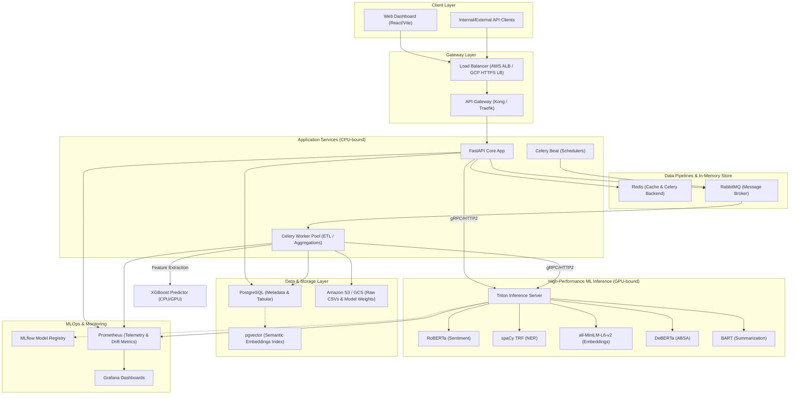
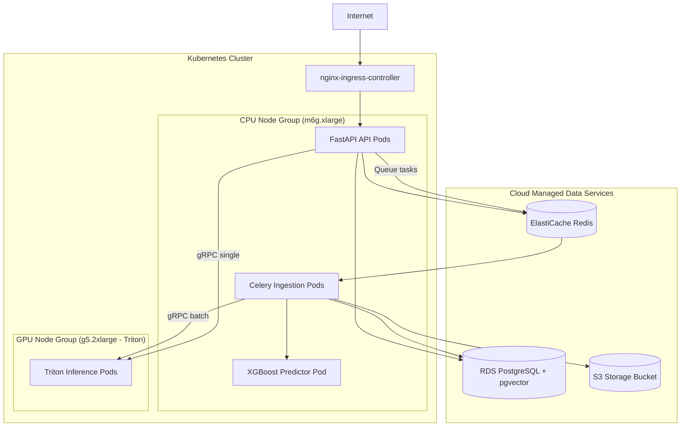
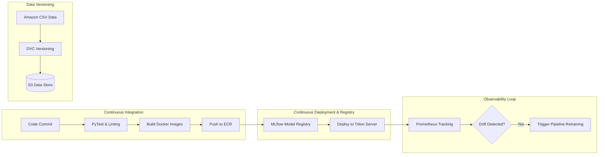
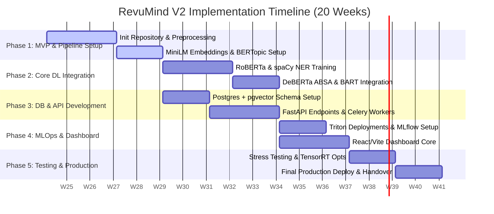

# RevuMind V2: Production-Grade Review Intelligence Platform
## System Architecture & MLOps Reference Design

This document details the production-grade architecture, database schema, API design, model pipelines, deployment strategies, and implementation roadmap for **RevuMind V2**, an AI-powered Review Intelligence Platform.

---

## 1. Complete Architecture Diagram

The RevuMind V2 platform uses a cloud-native, microservices-oriented architecture designed to handle thousands of concurrent queries and scale to millions of review analyses. It decouples high-throughput API endpoints from heavy GPU-bound deep learning inference and long-running batch ingestion pipelines.



---

## 2. Folder Structure

The project has been redesigned to follow a **feature-based architecture** and **pipeline architecture**, enforcing a clean separation of concerns.

```text
revumind/
├── config/
│   ├── __init__.py
│   ├── base.py                 # Core app configuration (pydantic-settings)
│   ├── database.py             # Database pool and connection settings
│   └── models.py               # Model configurations (endpoints, thresholds)
├── core/
│   ├── __init__.py
│   ├── database.py             # SQLAlchemy SessionLocal, Engine init
│   ├── security.py             # Auth verification (JWT / API Keys)
│   └── exceptions.py           # Global exception definitions
├── api/
│   ├── __init__.py
│   ├── v1/
│   │   ├── __init__.py
│   │   ├── endpoints/
│   │   │   ├── __init__.py
│   │   │   ├── reviews.py      # Upload CSV, process, and query reviews
│   │   │   ├── search.py       # Vector-based semantic search
│   │   │   ├── products.py     # Product-specific analytics
│   │   │   └── dashboard.py    # Metric aggregations for UI charts
│   │   └── router.py           # Unified v1 router mapping
│   └── dependencies.py         # DB session, auth, and Triton client injections
├── schemas/
│   ├── __init__.py
│   ├── review.py               # Pydantic schemas for request/response serialization
│   ├── entity.py
│   ├── aspect.py
│   ├── topic.py
│   └── summary.py
├── pipeline/
│   ├── __init__.py
│   ├── preprocess.py           # Text cleaning, emoji/HTML removal, normalization
│   ├── inference.py            # Orchestrator coordinating sequential model execution
│   └── tasks.py                # Celery tasks executing ingestion and batch runs
├── models/
│   ├── __init__.py
│   ├── base.py                 # Abstract Base Model Class for all ML modules
│   ├── sentiment/
│   │   ├── model.py            # RoBERTa wrapper (sends requests to Triton / HF)
│   │   └── train.py            # Finetuning script for classification head
│   ├── ner/
│   │   ├── model.py            # spaCy Transformer wrapper
│   │   └── train.py            # custom spaCy CLI configs & annotations compiler
│   ├── embeddings/
│   │   └── model.py            # MiniLM-L6-v2 vector extractor
│   ├── absa/
│   │   ├── model.py            # DeBERTa Aspect Sentiment classifier
│   │   └── train.py            # ABSA model training/finetuning
│   ├── topics/
│   │   └── model.py            # BERTopic UMAP/HDBSCAN wrapper
│   ├── summarizer/
│   │   ├── model.py            # BART Summarizer script
│   │   └── train.py            # Seq2Seq BART fine-tuning scripts
│   └── helpfulness/
│   │   ├── model.py            # XGBoost Model loader and inference
│   │   └── train.py            # XGBoost tabular trainer with Optuna
├── utils/
│   ├── __init__.py
│   ├── text.py                 # String manipulations
│   ├── readability.py          # Readability score computation modules
│   └── telemetry.py            # Prometheus metric register, logging setup
└── db/
    ├── __init__.py
    ├── models.py               # Declarative SQLAlchemy ORM models
    └── repository.py           # Centralized CRUD functions
```

---

## 3. Data Flow Diagram

The process ingestion pipe goes from the local raw CSV dataset to an analytical dashboard database representation.

```mermaid
flowchart LR
    A["Local Raw Dataset: archive/Reviews.csv"] --> B["Data Ingestion / Validation"]
    B --> C["Preprocessing Pipeline (preprocess.py)"]
    
    subgraph Preprocessing["Step 2: Preprocessing"]
        C --> C1["Remove Duplicates & Nulls"]
        C1 --> C2["Strip HTML, URLs & Emojis"]
        C2 --> C3["Language Filtering & Text Normalization"]
        C3 --> C4["Merge Summary + Text"]
    end

    C4 -->|clean_review_text| D["Inference Orchestrator"]

    subgraph Models["Models Execution Pipeline (Steps 3-7)"]
        D --> D1["all-MiniLM-L6-v2 Embeddings"]
        D --> D2["RoBERTa Sentiment"]
        D --> D3["spaCy TRF NER"]
        D --> D4["DeBERTa ABSA"]
        D1 -->|Embeddings Vector| D5["BERTopic Modeling"]
    end

    D2 & D3 & D4 & D5 --> E["Feature Extraction for Tabular Features"]
    
    subgraph Helpfulness["Step 9: XGBoost Model"]
        E --> F["Generate Tabular Vector"]
        F --> G["XGBoost Predict Helpfulness"]
    end

    G & D2 & D3 & D4 & D5 --> H["Aggregations Layer"]

    subgraph Summarizer["Step 8: BART Summary"]
        H --> I["Group Reviews by Product/Topic/Sentiment"]
        I --> J["BART Executive Summarizer"]
    end

    J & H --> K["Business Insights Engine"]
    K --> L[("PostgreSQL + pgvector")]
    L --> M["API Dashboard Layer"]
```



---

## 4. Model Interaction Workflow

The models in RevuMind V2 are not isolated; they form a pipeline where outputs are shared and consolidated:

1. **Preprocessing** produces `clean_review_text`.
2. **Embeddings Model** (`all-MiniLM-L6-v2`) runs on `clean_review_text` to produce a 384-dimensional embedding vector.
3. **Topic Modeling** (`BERTopic`) takes these embedding vectors, applies UMAP to lower dimensionality, runs HDBSCAN to cluster, and uses c-TF-IDF to tag each review with a `Topic ID`.
4. **Sentiment Analysis** (`RoBERTa`) evaluates the text to output a probability distribution over Positive, Negative, and Neutral.
5. **NER** (`spaCy TRF`) extracts entity tokens like Products, Brands, and Features.
6. **ABSA** (`DeBERTa ABSA`) maps sentiment to the extracted entities/aspects (e.g., finding the sentiment polarity of the aspect "Battery").
7. **Feature Extractor** gathers metrics from preceding models:
   - Metadata features: Rating, review length, word count, sentence count, Flesch Reading Ease score.
   - Model features: Sentiment label/confidence, aspect count, entity count, and topic ID.
8. **Helpfulness Model** (`XGBoost`) takes the feature vector and outputs the predicted helpfulness score.
9. **Summarization** (`BART`) aggregates reviews that belong to specific cohorts (e.g., all negative reviews for product *X*, or all reviews under topic *Battery Life*) and synthesizes a concise executive summary.
10. **Business Insights Engine** combines all outputs to output praises, complaints, paint points, and recommendations.

---

## 5. Model-by-Model Analysis

### 1. RoBERTa (Sentiment Analysis)
*   **Why Selected**: Robustly Optimized BERT Approach (RoBERTa) modifies BERT by dynamically masking tokens and removing next-sentence prediction. It provides excellent sentence-level context understanding for classification tasks, yielding much higher accuracy on reviews than basic Lexicon models (NLTK) or standard BERT.
*   **Input Data**: `clean_review_text` (truncated to 512 tokens).
*   **Output Data**: Probability scores for positive, negative, and neutral, along with the predicted class label and a confidence score.
*   **Training Strategy**: Supervised transfer learning. Finetune a pre-trained `roberta-base` classification head on the Amazon Reviews dataset.
*   **Fine-tuning Requirements**: Set up standard cross-entropy loss, Hugging Face `Trainer` API, learning rate of 2e-5, weight decay of 0.01, and AdamW optimizer. Split: 80% train, 10% validation, 10% test.
*   **Inference Workflow**: Tokenize input text $\rightarrow$ Send input to Triton (PyTorch backend) $\rightarrow$ Execute forward pass $\rightarrow$ Apply Softmax to model logits $\rightarrow$ Map outputs to DB.
*   **Expected Latency**: ~15ms on an NVIDIA T4 GPU (real-time batch size 1); ~3ms per review with dynamic batching (batch size 64).
*   **Hardware Requirements**: NVIDIA T4, L4, or A10G GPU for training and hosting.
*   **Storage Requirements**: ~500 MB for model weights.
*   **Scalability**: Compile to TensorRT to reduce footprint and improve latency.

### 2. spaCy Transformer (NER)
*   **Why Selected**: spaCy's `en_core_web_trf` (built on RoBERTa-base) provides production-grade speed and reliability. It parses text accurately, making it suitable for extracting Brands, Products, Organizations, and Locations from review contexts.
*   **Input Data**: `clean_review_text`.
*   **Output Data**: A list of structured entity records: entity text, label (BRAND, PRODUCT, ORG, LOC, FEATURE), starting index, and ending index.
*   **Training Strategy**: Transfer learning and entity definition tuning. Annotate reviews using tools like Prodigy (e.g., labeling specific features like "battery life" or "screen").
*   **Fine-tuning Requirements**: Adapt spaCy config templates for `spacy-transformers` to train the NER head while freezing the transformer backbone weights to avoid catastrophic forgetting.
*   **Inference Workflow**: Input text $\rightarrow$ Run spaCy pipeline tokenizer $\rightarrow$ Forward pass through RoBERTa backbone $\rightarrow$ Predict boundaries via transition-based parser.
*   **Expected Latency**: ~45ms per review on a GPU.
*   **Hardware Requirements**: Minimum 8GB VRAM GPU (Inference) and 16GB VRAM (Training).
*   **Storage Requirements**: ~400 MB.
*   **Scalability**: Execute batch runs via `nlp.pipe()` inside asynchronous Celery tasks to prevent bottlenecking the main process.

### 3. all-MiniLM-L6-v2 (Embeddings)
*   **Why Selected**: MiniLM is extremely lightweight (22M parameters) and maps sentences to a dense 384-dimensional vector space. It is faster and smaller than `all-mpnet-base-v2` while retaining over 90% of its performance.
*   **Input Data**: `clean_review_text` (truncated to 256 tokens).
*   **Output Data**: A 384-dimensional floating-point vector.
*   **Training Strategy**: Typically used out-of-the-box (zero-shot transfer) as it is pre-trained on over 1B sentence pairs. For domain-specific alignments, use Contrastive Learning.
*   **Fine-tuning Requirements**: Fine-tune using the `SentenceTransformers` library with a `MultipleNegativesRankingLoss` objective if specialized search alignments are needed.
*   **Inference Workflow**: Raw text $\rightarrow$ Sentencepiece Tokenizer $\rightarrow$ Encoder $\rightarrow$ Mean pooling of token embeddings $\rightarrow$ Unit normalization.
*   **Expected Latency**: <5ms on CPU; <1ms on GPU.
*   **Hardware Requirements**: Low resources. Standard CPU instance is sufficient.
*   **Storage Requirements**: ~90 MB for weights.
*   **Scalability**: Highly scalable. Can be deployed on standard x86 CPU Kubernetes clusters without GPU limits.

### 4. DeBERTa ABSA (Aspect Based Sentiment Analysis)
*   **Why Selected**: DeBERTa-v3 uses a disentangled attention mechanism and relative positions, outperforming RoBERTa on text classification. ABSA requires analyzing the specific sentiment surrounding an aspect (e.g., "the battery is bad but the display is great").
*   **Input Data**: `clean_review_text` paired with an aspect candidate (e.g., `[CLS] Battery [SEP] The battery is bad... [SEP]`).
*   **Output Data**: Sentiment label (positive, negative, neutral) and confidence score for each aspect.
*   **Training Strategy**: Supervised training on ABSA datasets (e.g., SemEval reviews) mapped to product domains.
*   **Fine-tuning Requirements**: Cross-entropy classification loss using a token-classification head over the span of identified aspect terms.
*   **Inference Workflow**: Extract aspects $\rightarrow$ Construct Text-Aspect pairs $\rightarrow$ Tokenize $\rightarrow$ Run DeBERTa classifier $\rightarrow$ Output aspect-sentiment mapping.
*   **Expected Latency**: ~60ms to 90ms per review depending on the number of aspects processed.
*   **Hardware Requirements**: A10G or L4 GPU recommended.
*   **Storage Requirements**: ~800 MB for model weights.
*   **Scalability**: Group all aspect tokens into a single inference batch to leverage Triton's GPU scheduling.

### 5. BERTopic (Topic Modeling)
*   **Why Selected**: BERTopic is modular and builds coherent topic distributions. It uses MiniLM embeddings, UMAP for dimensionality reduction, and HDBSCAN for clustering, resulting in robust topic generation.
*   **Input Data**: 384-dimensional review embeddings.
*   **Output Data**: Topic assignment ID, topic name label, and representative keywords.
*   **Training Strategy**: Unsupervised transductive learning. Fit UMAP and HDBSCAN models on a large corpus of reviews to define the clusters, then compute class-based TF-IDF (c-TF-IDF) weights for keywords.
*   **Fine-tuning Requirements**: Tune hyperparameters for UMAP (`n_neighbors`, `n_components`) and HDBSCAN (`min_cluster_size`, `min_samples`) using grid search to find stable cluster metrics.
*   **Inference Workflow**: Input Embedding $\rightarrow$ Project via UMAP $\rightarrow$ Map to cluster index via HDBSCAN $\rightarrow$ Output Topic details.
*   **Expected Latency**: <5ms per review for projection and assignment.
*   **Hardware Requirements**: Multi-core CPU is sufficient.
*   **Storage Requirements**: <25 MB for the serialized UMAP/HDBSCAN models and c-TF-IDF dictionaries.
*   **Scalability**: Process topic updates in batch tasks (e.g., weekly cron jobs) to recalculate clusters on new reviews.

### 6. BART (Summarization)
*   **Why Selected**: BART uses a bidirectional encoder and an autoregressive decoder. It is highly effective at multi-document summarization, condensing multiple review texts into a coherent summary.
*   **Input Data**: Concatenated review texts of a specific group (e.g., negative reviews for a product) up to 1024 tokens.
*   **Output Data**: An executive summary paragraph (50 to 150 words).
*   **Training Strategy**: Supervised Seq2Seq training. Start with `facebook/bart-large-cnn` and fine-tune on custom multi-review summaries.
*   **Fine-tuning Requirements**: Set up cross-entropy seq2seq loss using a learning rate of 3e-5, cosine warmup scheduling, and FP16 mixed precision.
*   **Inference Workflow**: Select grouped reviews $\rightarrow$ Format with separator tags $\rightarrow$ Tokenize $\rightarrow$ Auto-regressive generation (beam search) $\rightarrow$ Decode text.
*   **Expected Latency**: ~300ms to 600ms per group depending on generation length and beam size.
*   **Hardware Requirements**: Dedicated GPU (NVIDIA A10G or L4).
*   **Storage Requirements**: ~1.6 GB for weights.
*   **Scalability**: Offload summarization to asynchronous background queues to prevent blocking API responses.

### 7. XGBoost (Helpfulness Prediction)
*   **Why Selected**: XGBoost is highly efficient for tabular prediction tasks. It models non-linear interactions between readability, sentiment, and length features better than standard neural nets, and inferences in sub-milliseconds.
*   **Input Data**: Formatted tabular feature vector.
*   **Output Data**: Continuous predicted helpfulness score $[0.0, 1.0]$.
*   **Training Strategy**: Supervised regression using Mean Squared Error (MSE) or Huber Loss.
*   **Fine-tuning Requirements**: Grid search or Bayesian Optimization (Optuna) targeting hyperparameters (`max_depth`, `learning_rate`, `subsample`).
*   **Inference Workflow**: Load tabular vector $\rightarrow$ Forward pass through trees $\rightarrow$ Output float prediction.
*   **Expected Latency**: <1ms.
*   **Hardware Requirements**: Standard CPU container.
*   **Storage Requirements**: <5 MB.
*   **Scalability**: Highly scalable; handles millions of records per second on a single CPU core.

---

## 6. Training Pipeline

The training pipeline is structured to handle periodic model updates and fine-tuning.

```mermaid
flowchart TD
    A[Local Dataset: archive/Reviews.csv] --> B[Data Validation & DVC Sync]
    B --> C[Preprocessing Run (preprocess.py)]
    C --> D{Split Dataset}
    
    %% Split branches
    D -->|Train Split| E1[Fine-tune RoBERTa Sentiment]
    D -->|Train Split| E2[Fine-tune DeBERTa ABSA]
    D -->|Train Split| E3[Fine-tune spaCy NER]
    D -->|Train Split| E4[Fit BERTopic Pipeline]
    D -->|Train Split| E5[Train XGBoost Helpfulness]
    
    E1 & E2 & E3 & E4 & E5 --> F[Evaluate on Validation Split]
    F --> G{Pass Accuracy/F1 Gate?}
    
    G -->|No| H[Flag Alert / Retune Hyperparameters]
    G -->|Yes| I[Log Metrics to MLflow]
    I --> J[Save Weights to S3 / MLflow Registry]
    J --> K[Trigger CI/CD Deployment to Triton Server]
```

### Data Split & Loss Objectives
*   **Data Splits**: 80% Train, 10% Validation (for hyperparameter tuning and early stopping), 10% Test (unbiased final metrics evaluation).
*   **Validation Gating**:
    *   RoBERTa Sentiment: Weighted $F1 \ge 0.85$
    *   spaCy NER: Entity $F1 \ge 0.80$
    *   DeBERTa ABSA: Aspect Sentiment Accuracy $\ge 0.82$
    *   XGBoost: Root Mean Squared Error (RMSE) $\le 0.12$
*   **Loss Functions**:
    *   *Classification Models (RoBERTa, DeBERTa)*: Cross-Entropy Loss.
    *   *NER Model (spaCy)*: Transition-based alignment parser loss.
    *   *XGBoost*: Huber Loss (to reduce sensitivity to extreme outliers in helpfulness ratings).

---

## 7. Inference Pipeline

The system supports two processing modes: **Real-Time Single Review Prediction** and **Asynchronous Batch File Processing**.

### Real-Time Inference Cascade (API Call)
```
API Client 
  │ (POST /api/v1/reviews)
  ▼
FastAPI Route
  │ (Triggers sync processing)
  ▼
1. Preprocess raw text (clean_review_text)
  │
  ▼
2. Call Triton (all-MiniLM-L6-v2) ──► Obtain 384-d Embedding
  │
  ▼
3. Call Triton (RoBERTa Sentiment) ──► Obtain Pos/Neg/Neu Probabilities
  │
  ▼
4. Call Triton (spaCy NER) ──► Extract Brands, Products, Features
  │
  ▼
5. Call Triton (DeBERTa ABSA) ──► For each aspect, extract sentiment
  │
  ▼
6. Run UMAP/HDBSCAN ──► Assign Topic ID
  │
  ▼
7. Build Tabular Feature Vector ──► Pass to XGBoost ──► Get Helpfulness Score
  │
  ▼
Save outputs to PostgreSQL ──► Return JSON Response
```

### Asynchronous Batch Processing (CSV Upload & Local Ingestion)
*   **Alternative Ingestion (Local Dataset)**: For batch processing of the existing `./archive/Reviews.csv` dataset, the pipeline runs chunk-based extraction to generate a cleaned dataset at `./data/processed/clean_reviews.csv`.
*   **Step 1**: The client uploads a CSV file containing reviews (or points to a local path like `./archive/Reviews.csv`). FastAPI/Celery validates the schema and stores the file on S3/local staging.
*   **Step 2**: An ingestion task is queued in RabbitMQ/Redis and picked up by Celery workers.
*   **Step 3**: Celery workers stream the CSV contents (e.g. from `./archive/Reviews.csv`), execute the cleaning pipeline in `preprocess.py`, and create mini-batches.
*   **Step 4**: Batched requests are sent to Triton via gRPC to leverage GPU compute.
*   **Step 5**: Results are saved to the database in bulk using SQLAlchemy Core `bulk_insert_mappings()`.
*   **Step 6**: The database tables are updated, and a WebSocket or email notification is sent to the user upon completion.

---

## 8. Feature Engineering Plan (for XGBoost Helpfulness)

The XGBoost model predicts a continuous helpfulness score $[0.0, 1.0]$. The feature extraction pipeline constructs the following features from the text and preceding model outputs:

| Feature Name | Type | Description | Source |
| :--- | :--- | :--- | :--- |
| `review_char_len` | Integer | Total characters in review text | Text Analysis |
| `word_count` | Integer | Total words in review text | Tokenizer |
| `sentence_count` | Integer | Total sentences in review text | spaCy parser |
| `flesch_reading_ease` | Float | Readability score (0-100 scale; lower is harder to read) | Readability module |
| `flesch_kincaid_grade`| Float | Approximate reading grade level required | Readability module |
| `rating_normalized` | Float | User score (1 to 5) divided by 5.0 | Raw data |
| `sentiment_polarity` | Float | Probability(Positive) - Probability(Negative) | RoBERTa Sentiment |
| `sentiment_confidence`| Float | Highest probability value among sentiment outputs | RoBERTa Sentiment |
| `entity_density` | Float | Count of spaCy entities extracted / `word_count` | spaCy NER |
| `aspect_density` | Float | Count of aspect sentiments extracted / `word_count` | DeBERTa ABSA |
| `is_topic_assigned` | Binary | 1 if review falls in a valid BERTopic cluster; else 0 | BERTopic |
| `time_delta_days` | Float | Days between review creation date and pipeline run date | Raw data |

---

## 9. Database Schema Design

The PostgreSQL database uses the `pgvector` extension to index review embeddings and support semantic similarity queries.

```sql
-- Enable pgvector extension
CREATE EXTENSION IF NOT EXISTS vector;

-- 1. Products Table
CREATE TABLE products (
    id VARCHAR(50) PRIMARY KEY,
    brand VARCHAR(100),
    category VARCHAR(100),
    created_at TIMESTAMP WITH TIME ZONE DEFAULT CURRENT_TIMESTAMP
);

-- 2. Reviews Table
CREATE TABLE reviews (
    id SERIAL PRIMARY KEY,
    product_id VARCHAR(50) REFERENCES products(id) ON DELETE CASCADE,
    user_id VARCHAR(50),
    profile_name VARCHAR(255),
    score INT CHECK (score BETWEEN 1 AND 5),
    helpfulness_numerator INT DEFAULT 0,
    helpfulness_denominator INT DEFAULT 0,
    helpfulness_score FLOAT GENERATED ALWAYS AS (
        CASE 
            WHEN helpfulness_denominator > 0 THEN (helpfulness_numerator::float / helpfulness_denominator::float)
            ELSE 0.0
        END
    ) STORED,
    predicted_helpfulness FLOAT,
    review_time TIMESTAMP WITH TIME ZONE,
    summary TEXT,
    review_text TEXT,
    clean_review_text TEXT NOT NULL,
    topic_id INT,
    created_at TIMESTAMP WITH TIME ZONE DEFAULT CURRENT_TIMESTAMP
);

-- 3. Review Embeddings Table (one-to-one for vector scaling isolation)
CREATE TABLE review_embeddings (
    review_id INT PRIMARY KEY REFERENCES reviews(id) ON DELETE CASCADE,
    embedding vector(384) NOT NULL
);

-- 4. Entities Table
CREATE TABLE entities (
    id BIGSERIAL PRIMARY KEY,
    review_id INT REFERENCES reviews(id) ON DELETE CASCADE,
    entity_text VARCHAR(255) NOT NULL,
    entity_type VARCHAR(50) NOT NULL, -- e.g., 'BRAND', 'PRODUCT', 'FEATURE'
    confidence FLOAT,
    start_char INT,
    end_char INT
);

-- 5. Aspect Sentiments Table
CREATE TABLE aspect_sentiments (
    id BIGSERIAL PRIMARY KEY,
    review_id INT REFERENCES reviews(id) ON DELETE CASCADE,
    aspect_term VARCHAR(255) NOT NULL,
    sentiment_label VARCHAR(20) NOT NULL, -- 'positive', 'negative', 'neutral'
    confidence FLOAT
);

-- 6. Topics Table (BERTopic Metadata)
CREATE TABLE topics (
    topic_id INT PRIMARY KEY,
    name VARCHAR(255) NOT NULL,
    keywords VARCHAR(100)[] NOT NULL,
    created_at TIMESTAMP WITH TIME ZONE DEFAULT CURRENT_TIMESTAMP
);

-- 7. Summaries Table (BART Cohort summaries)
CREATE TABLE summaries (
    id SERIAL PRIMARY KEY,
    product_id VARCHAR(50) REFERENCES products(id) ON DELETE CASCADE,
    cohort_type VARCHAR(50) NOT NULL, -- 'all', 'positive', 'negative', 'topic'
    cohort_value VARCHAR(100),         -- e.g., topic ID or brand name
    summary_text TEXT NOT NULL,
    generated_at TIMESTAMP WITH TIME ZONE DEFAULT CURRENT_TIMESTAMP
);

-- Create Indexes for Performance
CREATE INDEX idx_reviews_product_id ON reviews(product_id);
CREATE INDEX idx_reviews_topic_id ON reviews(topic_id);
CREATE INDEX idx_aspect_sentiments_term ON aspect_sentiments(aspect_term);
CREATE INDEX idx_entities_text ON entities(entity_text);

-- Create HNSW Vector Index for Vector Search Performance
CREATE INDEX idx_embeddings_cosine ON review_embeddings 
USING hnsw (embedding vector_cosine_ops);
```

---

## 10. API Design (FastAPI)

The REST API endpoints support JSON serialization and use OAuth2/API Key authentication.

### Ingestion API
```http
POST /api/v1/reviews/upload
Content-Type: multipart/form-data
Authorization: Bearer <token>

Request Parameters:
  - file: CSV file (Amazon format)
  - product_id: Optional String

Response: 202 Accepted
{
  "job_id": "job_8c72834b-4b10",
  "status": "QUEUED",
  "message": "File processing started.",
  "estimated_time_seconds": 120
}
```

```http
GET /api/v1/jobs/job_8c72834b-4b10
Response: 200 OK
{
  "job_id": "job_8c72834b-4b10",
  "status": "PROCESSING",
  "progress": 0.45,
  "processed_records": 450,
  "total_records": 1000,
  "completed_at": null
}
```

### Query & Search API
```http
POST /api/v1/search/semantic
Content-Type: application/json

{
  "query": "long battery life but fragile case",
  "product_id": "B00005T3E1",
  "limit": 5,
  "similarity_threshold": 0.65
}

Response: 200 OK
{
  "results": [
    {
      "review_id": 1084,
      "text": "The phone charger holds a charge for two days, but the frame feels cheap and cracked on day three.",
      "score": 3,
      "similarity": 0.792,
      "sentiment": "neutral",
      "aspects": [
        {"aspect": "charger", "sentiment": "positive"},
        {"aspect": "frame", "sentiment": "negative"}
      ]
    }
  ]
}
```

### Insights API
```http
GET /api/v1/products/B00005T3E1/insights
Response: 200 OK
{
  "product_id": "B00005T3E1",
  "total_reviews": 4820,
  "overall_sentiment": {
    "positive": 0.72,
    "neutral": 0.10,
    "negative": 0.18
  },
  "executive_summary": "Customers are generally pleased with the product's battery lifespan and sound clarity. However, multiple complaints highlight issues with outer frame durability and the charger's cord length.",
  "top_praises": [
    {"topic": "Battery Performance", "percentage": 42.1},
    {"topic": "Sound Quality", "percentage": 28.3}
  ],
  "top_complaints": [
    {"topic": "Structural Durability", "percentage": 14.2},
    {"topic": "Cable Length", "percentage": 8.5}
  ],
  "trending_features": ["USB-C Charging", "Active Noise Cancellation"]
}
```

---

## 11. Dashboard Layer Design

The interface uses a charcoal-gray theme with vibrant accents to display insights clearly.

```
┌────────────────────────────────────────────────────────────────────────┐
│  REVUMIND V2 ── Review Intelligence Platform       [Upload Reviews]    │
├────────────────────────────────────────────────────────────────────────┤
│ PRODUCT: [ B00005T3E1 - SmartPhone X ]   DATES: [Last 30 Days]         │
├──────────────────────┬────────────────────────┬────────────────────────┤
│ TOTAL REVIEWS        │ SENTIMENT RATIO        │ AVG HELPFULNESS SCORE  │
│ 4,820 (▲ 12%)        │ Pos: 72% | Neu: 10%    │ 0.84 (Predicted)       │
├──────────────────────┴────────────────────────┴────────────────────────┤
│ ┌────────────────────────────────────────────────────────────────────┐ │
│ │ EXECUTIVE SUMMARY (BART)                                           │ │
│ │ "Users praise the display and battery capacity, but identify       │ │
│ │ design faults in the charging port and glass screen durability."   │ │
│ └────────────────────────────────────────────────────────────────────┘ │
├────────────────────────────────────────┬───────────────────────────────┤
│ ASPECT SENTIMENT HEATMAP (DeBERTa)     │ TOPICS TREEMAP (BERTopic)      │
│ [Display]    ████████████░░░░ Positive │ ┌───────────────────┬───────┐ │
│ [Battery]    ███████████████░ Positive │ │ Battery Life      │ Audio │ │
│ [Price]      ████████░░░░░░░ Neutral  │ │ 42%               │ 15%   │ │
│ [Durability] ████░░░░░░░░░░░ Negative │ ├───────────────────┼───────┤ │
│                                        │ │ Shipping   │Other │ Support│ │
│                                        │ │ 12%        │11%   │ 20%   │ │
└────────────────────────────────────────┴───────────────────────────────┘
```

*   **Key Charts & Visuals**:
    *   *Aspect Sentiment Heatmap*: Lists key aspects horizontally against three color bands (Green: Positive, Amber: Neutral, Crimson: Negative).
    *   *Topic Treemap*: Shows the distribution of categorized customer feedback topics.
    *   *Interactive Semantic Search Box*: Allows users to search reviews using natural language.
    *   *Trend Graph*: Displays sentiment percentages over time.

---

## 12. Deployment Architecture

The production environment runs on a Kubernetes cluster split into CPU and GPU node groups.



*   **Triton Inference Server**: Hosts RoBERTa, spaCy TRF, DeBERTa, and BART. Employs **Dynamic Batching** to group single inference requests into dynamic hardware batches.
*   **Database Scaling**: Primary database instances handle write operations, while read-only replicas serve dashboard queries and vector similarity searches.

---

## 13. MLOps Architecture



*   **Experiment Tracking**: MLflow logs hyperparameter settings, training runs, loss curves, and evaluation metrics (Accuracy, Recall, ROC-AUC) for all seven models.
*   **Data Drift Monitoring**: The API measures input feature metrics (e.g., shifts in review lengths, distribution of raw review ratings) and outputs (e.g., changes in the ratio of negative classifications). If the population stability index (PSI) exceeds $0.2$, the system triggers an alert to initiate retraining.

---

## 14. Risks, Bottlenecks & Optimizations

| Risk/Bottleneck | Description | Mitigation Strategy |
| :--- | :--- | :--- |
| **Inference Latency Cascade** | Processing a single review through all deep learning models sequentially can take over 200ms. | Compile model weights (RoBERTa, DeBERTa, spaCy, BART) to **ONNX Runtime** or **TensorRT** formats. This reduces latency by 3x to 5x. |
| **GPU Out-of-Memory (OOM)** | Generation models (like BART) and large transformers (DeBERTa) can consume significant VRAM under load. | Implement **Dynamic Batching** and **Max Queue Delay** settings on Triton. Cap sequence lengths to 512 tokens and use FP16 precision. |
| **pgvector Index Degraded Search** | HNSW index performance can decline as the database grows to millions of reviews. | Adjust index parameters: set `m = 16` and `ef_construction = 64`. Periodically rebuild the HNSW index during off-peak hours. |
| **Topic Drift** | Static BERTopic clusters may fail to capture new trends and vocabulary. | Implement an incremental clustering approach or schedule weekly cron jobs to refit BERTopic on the latest review cohorts. |

---

## 15. Development Roadmap



---

## 16. Future Scalability Roadmap

1. **Multi-Tenant Architecture**: Add organizational scoping at the database level (`tenant_id` columns) and configure isolated database schemas to ensure tenant separation.
2. **Distributed Stream Processing**: Integrate Apache Kafka and Apache Flink to stream review ingestion, running analysis in near-real-time as customers post feedback.
3. **LLM RAG Integration**: Use the extracted 384-dimensional vector embeddings to build a Retrieval-Augmented Generation (RAG) agent. This will allow business users to ask conversational questions about their reviews (e.g., *"Why are users complaining about shipping in California?"*).
4. **Distillation**: Train smaller student models (e.g., DistilRoBERTa, TinyBERT) to replace the larger transformer models for high-volume endpoints, reducing infrastructure costs.
